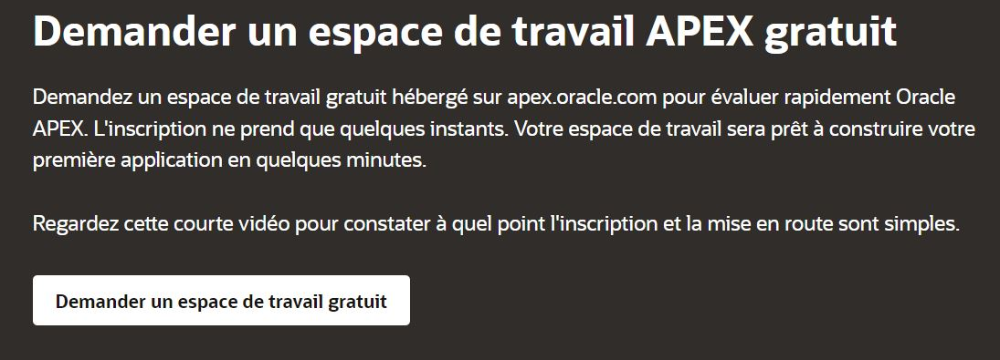

--- 
layout: post
title: Creation d'un workspace Oracle (APEX) en ligne!
date: 2022-06-03
Description: This post describes a step by step method to create an online workspace for Oracle APEX.
tag: Oracle Teaching 
---

Travaillez rapidement avec Oracle APEX en demandant un espace de travail gratuit hébergé sur apex.oracle.com. L'inscription ne prend que quelques instants et en quelques minutes, votre espace de travail sera prêt et vous pourrez profiter d'Oracle pleinement.

1.  [Allez sur la plateforme dediée](https://apex.oracle.com/fr/learn/getting-started/) 

2. Naviguez vers l'option "Demander un espace de travail"     
     

3. Remplissez le formulaire, et n'oubliez pas d'indiquer (cocher) que vous avez l'intention de l'utiliser à des fins personnelles

4. Validez votre mail (vous recevrez egalement le nom du workspace, le nom d'utilisateur) 

5. Creer un nouveau mot de passe 

6. That's all, vous êtes prêts à commencer votre apprentissage (et beaucoup plus). Allez dans SQL Workshop pour quelques tests !!
